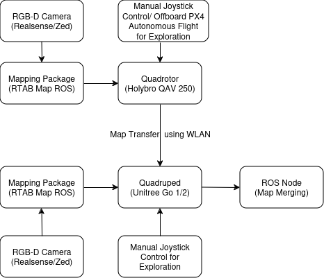

# Collaborative Mapping using UAV and Quadruped
Author: Pushkar Dave

## Project Description
This project focuses on integrating a quadrotor and a quadruped for collaborative mapping in a cluttered indoor environment, which can serve as a foundation for efficient and safe navigation of the quadruped. The UAV will first explore the environment and create a 3D map, which will then be sent to the quadruped. The quadruped will continue exploring and add more details to the map. A major part of the project will involve merging the two maps to create a comprehensive and accurate representation of the environment.

This project is inspired by this paper from ETH Zurich: [Collaborative Navigation for Flying and Walking Robots](https://ieeexplore.ieee.org/stamp/stamp.jsp?tp=&arnumber=7759443&tag=1)

However, this paper involves multiple components that cannot be replicated or fully implemented within a 10-week time frame. Therefore, I have adapted it into a simplified version of the original idea.

## Technical Objectives
- Fallback Goal:
    - 3D Mapping using a single UAV, with autonomous indoor flight (using OptiTrack).
    - Adding april tags in the environment, for localization support.

- Core Goal:
    - Sequential 3D Mapping using the quadrotor and quadruped (manual exploration)
    - Merging data from the two robots, to obtain an accurate global map
    - Autonomous exploration of the environment by the quadrotor and quadruped

- Reach Goal:
    - Simultaenous exploration, where quadrotor sends the partial map data to the quadruped, and the maps are merged in real-time

## Learning Objectives
- 3D Mapping
- Localization
- Map Merging (Sensor Fusion)

## Block Diagram

## Tasks
- ROS Setup for Quadruped (porting packages/wrappers written by previous cohorts to ROS2 Jazzy)
(Time Frame: 1 Week)
- Manual Indoor Stable Flight for Quadrotor
(Time Frame: 1 Week)
- RTAB Map Setup on Realsense/Zed RGBD cameras (available for ROS2 Jazzy)
(Time Frame: 1 Week)
- Mount the camera on quadrotor and quadruped and try to manually explore the environment
(Time Frame: 1 Week)
- WLAN Map data transfer from quadrotor to quadruped (using Raspberry Pi)
(Time Frame: 4 days)
- Integrating/Writing ROS Node/Package to merge map data obtained from RTAB Map
(Time Frame: 2 Weeks)
- PX4 based Offboard Control to autonomously explore the environment using the quadrotor
    - Waypoint based exploration for quadrotor and quadruped(assuming known bounds of the map)
(Time Frame: 1.5 Weeks)
- Simultaenous mapping, where quadrotor and quadruped add data to the global map in real-time together
(Time Frame: 2 Weeks)

## Risks, Challenges and Uncertainities
**Highest Risk**: Integrating RTAB Map to run on the quadrotor

**Least Sure**: Map merging using RTAB Map output data (Occupancy Grid/ OctoMap)

**Resolutions**: There is a ROS1 Example by the RTAB Map authors on RTAB Mapping using quadrotors. The forum is also active and responds to the questions quickly. There is an inbuilt map merging algorithm in RTAB Map- extending it to merge data using two different robots or finding other packages that can do this is the current objective. 

## Tools and References
**Hardware**:
- Holybro QAV 250 Quadrotor Kit (available - ordered last quarter)
- Spare motors, propellers and battery for quadrotor (to be ordered)
- Unitree GO 1/2 Quadruped (available in the lab)
- Taranis QX7 RC Transmitter for Quadrotor (available in the lab)
- OptiTrack System (available in the lab)
- 2 x Raspberry Pi 5 (to be ordered)
- 2 x RGB-D Cameras (to be ordered)

**Software**:
- ROS2 (https://docs.ros.org/en/jazzy/index.html)
- RTAB Map ROS2 Jazzy (https://index.ros.org/r/rtabmap_ros/#jazzy)
- PX4 Autopilot (https://docs.px4.io/main/en/)
- C++ (https://devdocs.io/cpp/)

**References**:
- RTAB Map Drone example (https://github.com/matlabbe/rtabmap_drone_example)
- Indoor flight using OptiTrack (https://github.com/Arcane-01/Indoor-Flight)
